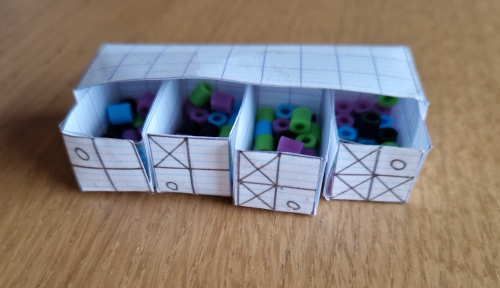

# Carré ment

"Carré ment" est une mini Intelligence Artificielle à dérouler manuellement à l'aide d'un matériel minimaliste.

Une machine ne sait dessiner qu'un "coin", ⛶, et le positionner de 4 manières différentes.

Elle ne sait pas faire de carré. On veut lui faire apprendre à faire des carrés en positionnant correctement ses coins.

## Déroulement d'une partie

Il vous faudra :

- des perles de 4 couleurs différentes
- 4 boites
- 4 coins de carré, dessinés sur une feuille de papier

Disposition :

- Chaque boite contient 5 perles de 4 couleurs différentes
- La première boite correspond au coin en haut à gauche
- La deuxième boite correspond au coin en bas à gauche
- La troisième boite correspond au coin en bas à droite
- La quatrième boite correspond au coin en haut à droite

Tour de jeu :

- Règles :
  - Si la perle est jaune, prendre un dessin coin haut-gauche d'un carré.
  - Si la perle est verte, prendre un dessin coin bas-gauche
  - Si la perle est bleue, prendre un dessin coin bas-droit
  - Si la perle est rouge, prendre un dessin coin haut-gauche

- Prendre une perle au hasard dans la première boite. Regardez la couleur et positionnez le dessin coin dans la case 1 du dessin.

| h |  h  |
|:--:|:--:|
| **case 1** |  case 4 |
| case 2 |  case 3 |

Si la forme est correcte, c'est-à-dire qu'elle permet de former un carré, remettez cette perle dans la première boite. Si la forme est incorrecte, retirez la perle de la première boite.

- Prendre une perle au hasard dans la deuxième boite. Regardez la couleur et positionnez le dessin coin dans la case 2 du dessin.

| h |  h  |
|:--:|:--:|
| case 1 |  case 4 |
| **case 2** |  case 3 |

Si la forme est correcte, c'est-à-dire qu'elle permet de former un carré, remettez cette perle dans la deuxième boite. Si la forme est incorrecte, retirez la perle de la deuxième boite.

- Prendre une perle au hasard dans la troisième boite. Regardez la couleur et positionnez le dessin coin dans la case 3 du dessin.

| h |  h  |
|:--:|:--:|
| case 1 |  case 4 |
| case 2 |  **case 3** |

Si la forme est correcte, c'est-à-dire qu'elle permet de former un carré, remettez cette perle dans la troisième boite. Si la forme est incorrecte, retirez la perle de la troisième boite.

 - Prendre une perle au hasard dans la quatrième boite. Regardez la couleur et positionnez le dessin coin dans la case 3 du dessin.

| h |  h  |
|:--:|:--:|
| case 1 |  **case 4** |
| case 2 |  case 3 |

Si la forme est correcte, c'est-à-dire qu'elle permet de former un carré, remettez cette perle dans la quatrième boite. Si la forme est incorrecte, retirez la perle de la quatrième boite.

Répétez les tours de jeu, de telle sorte que l'intelligence artificielle apprenne de plus en plus à former un carré.

Lors de chaque tour, notez dans un fichier CSV (voir un exemple dans "source/scores.csv"), le tirage que vous avez fait. Dans l'exemple suivant, on a tiré :

- une perle verte - mettre un L en premier
- Une perle jaune - mettre un R en deuxième
- Une perle rouge - mettre un I en troisième
- Une perle bleue - mettre un J en quatrième

Cela donne :

> L;R;I;J

Mettez autant de lignes que de tours de jeu.

## Comment lancer le programme

Enregistrez votre fichier CSV dans le répertoire "source" et nommez-le "scores.csv".

Lancer la commande suivante :

> python3 carrement.py

Le fichier "animation.gif" est généré dans le répertoire "resultat". Vous pouvez le visualiser pour observer le déroulement de vos tours de partie.

Ici, l'animation sur un exemple d'une partie :

